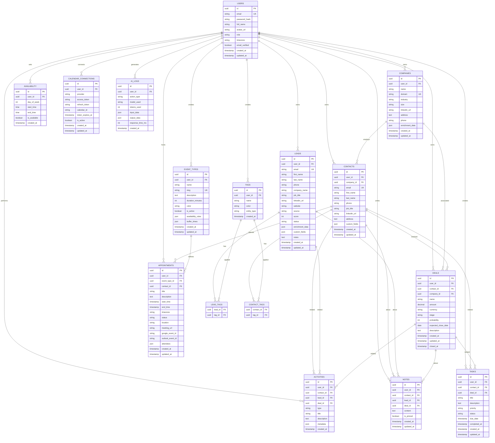
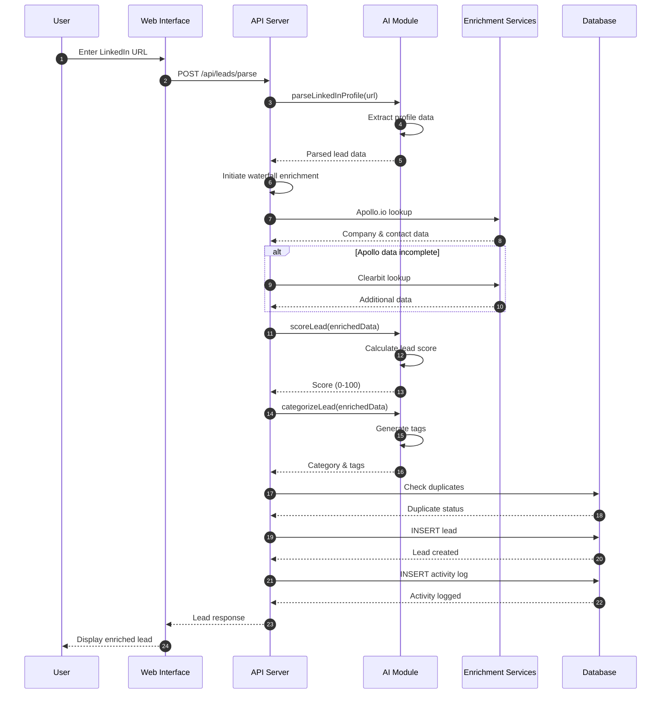
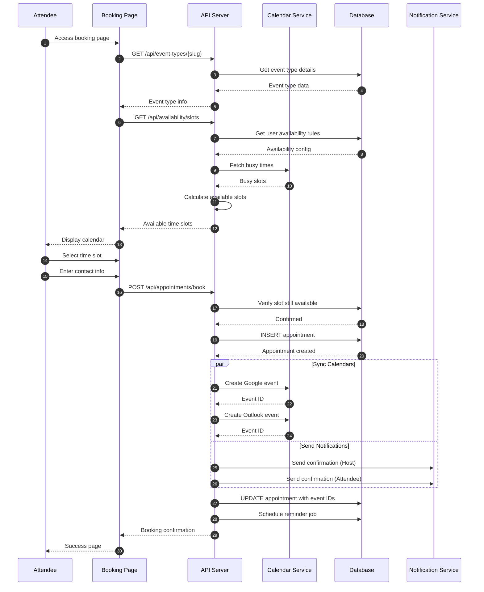
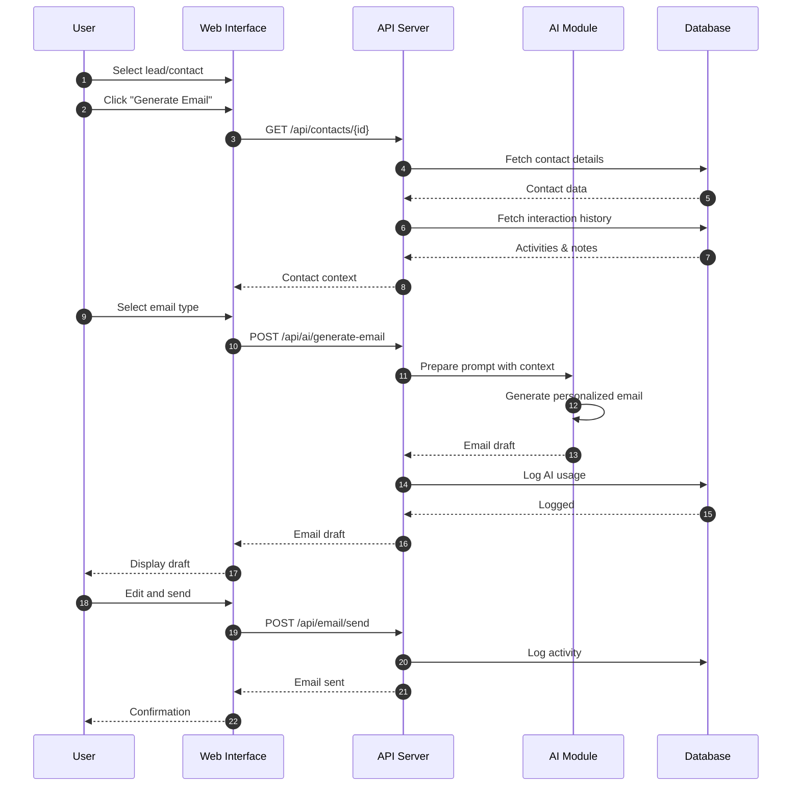
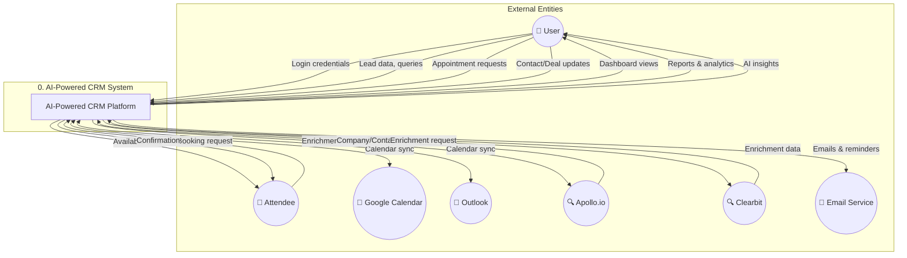
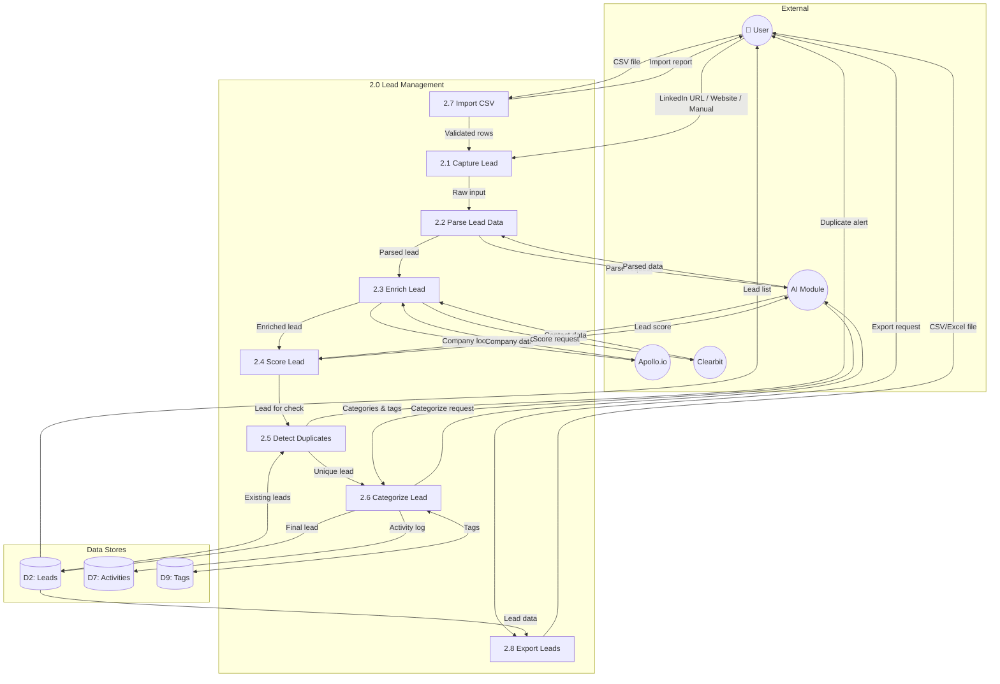
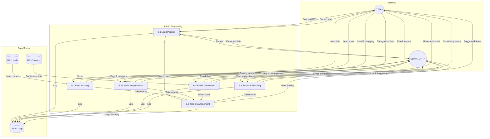

# 🤖 AI-Powered CRM Platform - System Analysis Document

<p align="center">
  <strong>CNC111 - Web Programming Project</strong>
</p>

---

## 👥 Team Members

| Name | Student ID |
|------|------------|
| **Moaz Hassan Ismail El Garawany** | 320240032 |
| **Ahmed Hossam Aldeen Alsayed** | 320240051 |
| **Ahmed Mahmoud** | 320240024 |

---

## 📋 Table of Contents

1. [System Overview](#-system-overview)
2. [Use Case Diagram](#-use-case-diagram)
3. [Narrative Use Cases](#-narrative-use-cases)
4. [Entity Relationship Diagram (ERD)](#-entity-relationship-diagram-erd)
5. [Sequence Diagrams](#-sequence-diagrams)
6. [Data Flow Diagrams (DFD)](#-data-flow-diagrams-dfd)

---

## 🎯 System Overview

The **AI-Powered CRM Platform** is a modern Customer Relationship Management system that leverages artificial intelligence to enhance lead management, appointment scheduling, and customer interactions. The system is built using Next.js 14+, Supabase, and integrates with OpenAI GPT-4o for intelligent automation.

### Key Modules:
- **LeadCatch Module** - AI-powered lead capture, parsing, and enrichment
- **Appointments Module** - Smart scheduling with calendar integrations
- **CRM Core** - Contact management, sales pipeline, and analytics
- **AI Module** - Shared AI services for all modules

---

## 📊 Use Case Diagram

```mermaid
flowchart TB
    subgraph Actors
        U[👤 User/Sales Rep]
        A[👨‍💼 Admin]
        AI[🤖 AI System]
        CS[📧 Calendar Service]
        ES[📬 Enrichment Service]
    end

    subgraph UC_Auth["🔐 Authentication"]
        UC1[Login]
        UC2[Register]
        UC3[Reset Password]
        UC4[Verify Email]
    end

    subgraph UC_LeadCatch["🎯 LeadCatch Module"]
        UC5[Capture Lead]
        UC6[Parse LinkedIn Profile]
        UC7[Import CSV]
        UC8[Enrich Lead]
        UC9[Score Lead]
        UC10[Detect Duplicates]
        UC11[Export Leads]
        UC12[Categorize Lead]
    end

    subgraph UC_Appointments["📅 Appointments Module"]
        UC13[Schedule Appointment]
        UC14[Manage Availability]
        UC15[Sync Calendar]
        UC16[Book Meeting]
        UC17[Reschedule Appointment]
        UC18[Cancel Appointment]
        UC19[Send Reminders]
    end

    subgraph UC_CRM["💼 CRM Core"]
        UC20[Manage Contacts]
        UC21[Manage Companies]
        UC22[Manage Deals]
        UC23[Create Tasks]
        UC24[View Pipeline]
        UC25[View Analytics]
        UC26[Add Notes]
    end

    subgraph UC_Admin["⚙️ Administration"]
        UC27[Manage Users]
        UC28[Configure Settings]
        UC29[View Reports]
        UC30[Manage Event Types]
    end

    %% User connections
    U --> UC1
    U --> UC2
    U --> UC5
    U --> UC6
    U --> UC7
    U --> UC11
    U --> UC13
    U --> UC14
    U --> UC16
    U --> UC17
    U --> UC18
    U --> UC20
    U --> UC21
    U --> UC22
    U --> UC23
    U --> UC24
    U --> UC25
    U --> UC26

    %% Admin connections
    A --> UC1
    A --> UC27
    A --> UC28
    A --> UC29
    A --> UC30

    %% AI System connections
    AI --> UC8
    AI --> UC9
    AI --> UC10
    AI --> UC12
    AI --> UC19

    %% External System connections
    CS --> UC15
    CS --> UC19
    ES --> UC8

    %% Include relationships
    UC5 -.->|includes| UC8
    UC5 -.->|includes| UC9
    UC6 -.->|extends| UC5
    UC7 -.->|extends| UC5
    UC8 -.->|includes| UC12
    UC16 -.->|includes| UC19
    UC13 -.->|includes| UC15
```



---

## 📝 Narrative Use Cases

### Use Case 1: Capture and Enrich Lead

| **Use Case ID** | UC-001 |
|-----------------|--------|
| **Use Case Name** | Capture and Enrich Lead |
| **Actor(s)** | User (Sales Rep), AI System, Enrichment Service |
| **Description** | User captures a lead from various sources, and the system automatically enriches it with additional data using AI |
| **Preconditions** | User is logged into the system |
| **Postconditions** | Lead is stored in database with enriched data and AI-generated score |

**Main Flow:**
1. User accesses the LeadCatch module
2. User selects input method (LinkedIn URL, Website, Manual Entry, or CSV Import)
3. User provides lead information
4. System validates input data
5. AI parses and extracts lead information
6. System initiates waterfall enrichment:
   - Apollo.io lookup
   - Clearbit lookup
   - Additional providers as needed
7. AI scores the lead (1-100)
8. AI categorizes and tags the lead
9. System checks for duplicates
10. System saves the lead to database
11. System displays enriched lead profile to user

**Alternative Flows:**
- **4a.** Invalid input: System displays error message, returns to step 3
- **6a.** Enrichment service unavailable: System saves partial data, flags for retry
- **9a.** Duplicate found: System prompts user to merge or create new

---

### Use Case 2: Schedule Appointment

| **Use Case ID** | UC-002 |
|-----------------|--------|
| **Use Case Name** | Schedule Appointment |
| **Actor(s)** | User, External Attendee, Calendar Service, AI System |
| **Description** | User or external attendee schedules a meeting through the appointment system |
| **Preconditions** | User has configured availability and event types |
| **Postconditions** | Appointment is created and synced to all calendars |

**Main Flow:**
1. Attendee accesses public booking page
2. Attendee selects event type
3. System retrieves user's availability from connected calendars
4. System calculates available time slots
5. Attendee selects preferred date and time
6. Attendee enters contact information
7. AI suggests optimal meeting time (optional)
8. System validates availability (no conflicts)
9. System creates appointment in database
10. System syncs to Google Calendar/Outlook
11. System sends confirmation email to both parties
12. System schedules reminder notifications

**Alternative Flows:**
- **5a.** No available slots: System suggests alternative dates
- **8a.** Conflict detected: System returns to step 5 with updated availability
- **10a.** Calendar sync fails: System queues for retry, notifies user

---

### Use Case 3: Manage Sales Pipeline

| **Use Case ID** | UC-003 |
|-----------------|--------|
| **Use Case Name** | Manage Sales Pipeline |
| **Actor(s)** | User (Sales Rep), Admin |
| **Description** | User manages deals through different stages of the sales pipeline |
| **Preconditions** | User is logged in, deals exist in the system |
| **Postconditions** | Deal status is updated, activities are logged |

**Main Flow:**
1. User accesses Pipeline view (Kanban board)
2. System displays deals organized by stage
3. User drags deal card to new stage
4. System updates deal status
5. System logs activity in timeline
6. System triggers automated actions (notifications, tasks)
7. System updates analytics

**Alternative Flows:**
- **3a.** User clicks on deal: System opens deal detail view
- **3b.** User adds new deal: System opens deal creation form

---

### Use Case 4: Import Leads from CSV

| **Use Case ID** | UC-004 |
|-----------------|--------|
| **Use Case Name** | Import Leads from CSV |
| **Actor(s)** | User, AI System |
| **Description** | User bulk imports leads from a CSV file |
| **Preconditions** | User has a CSV file with lead data |
| **Postconditions** | All valid leads are imported and enriched |

**Main Flow:**
1. User accesses Import function in LeadCatch
2. User uploads CSV file
3. System validates file format
4. System displays field mapping interface
5. User maps CSV columns to lead fields
6. System validates data in each row
7. System detects duplicates
8. User confirms import (with duplicate handling options)
9. System imports leads in batches
10. System queues leads for AI enrichment
11. System displays import summary report

**Alternative Flows:**
- **3a.** Invalid format: System displays supported formats, returns to step 2
- **6a.** Validation errors: System highlights invalid rows, allows correction
- **7a.** Duplicates found: System displays duplicate count, offers merge/skip options

---

### Use Case 5: Generate AI-Powered Email

| **Use Case ID** | UC-005 |
|-----------------|--------|
| **Use Case Name** | Generate AI-Powered Email |
| **Actor(s)** | User, AI System |
| **Description** | User generates personalized email content using AI |
| **Preconditions** | User has selected a lead or contact |
| **Postconditions** | Email is generated and ready to send |

**Main Flow:**
1. User selects a lead/contact
2. User clicks "Generate Email"
3. User selects email type (intro, follow-up, proposal, etc.)
4. System retrieves lead context (company, role, interactions)
5. AI generates personalized email draft
6. System displays draft to user
7. User reviews and edits
8. User sends or saves draft

**Alternative Flows:**
- **5a.** AI generation fails: System displays error, offers retry
- **7a.** User regenerates: Returns to step 5 with modifications

---

## 🗃️ Entity Relationship Diagram (ERD)



---

## 🔄 Sequence Diagrams

### Sequence Diagram 1: Lead Capture and Enrichment



### Sequence Diagram 2: Appointment Booking



### Sequence Diagram 3: AI Email Generation



---

## 📈 Data Flow Diagrams (DFD)

### Level 0: Context Diagram



### Level 1: Main Processes

```mermaid
flowchart TB
    subgraph External["External Entities"]
        U((👤 User))
        ATT((👥 Attendee))
        GCAL((📅 Google Calendar))
        OUTLOOK((📅 Outlook))
        ENRICH((🔍 Enrichment APIs))
        EMAIL((📧 Email Service))
    end

    subgraph Processes["Processes"]
        P1[1.0 Authentication & Authorization]
        P2[2.0 Lead Management]
        P3[3.0 Appointment Scheduling]
        P4[4.0 Contact & Company Management]
        P5[5.0 Deal Management]
        P6[6.0 AI Processing]
        P7[7.0 Reporting & Analytics]
    end

    subgraph DataStores["Data Stores"]
        D1[(D1: Users)]
        D2[(D2: Leads)]
        D3[(D3: Contacts)]
        D4[(D4: Companies)]
        D5[(D5: Appointments)]
        D6[(D6: Deals)]
        D7[(D7: Activities)]
        D8[(D8: AI Logs)]
    end

    %% Authentication flows
    U -->|Credentials| P1
    P1 -->|Session token| U
    P1 <-->|User data| D1

    %% Lead Management flows
    U -->|Lead input| P2
    P2 -->|Lead list| U
    P2 -->|Enrichment request| ENRICH
    ENRICH -->|Enriched data| P2
    P2 <-->|Lead data| D2
    P2 -->|AI request| P6
    P6 -->|Score & tags| P2
    P2 -->|Activity| D7

    %% Appointment flows
    U -->|Availability config| P3
    ATT -->|Booking request| P3
    P3 -->|Available slots| ATT
    P3 -->|Confirmation| ATT
    P3 <-->|Appointment data| D5
    P3 <-->|Calendar events| GCAL
    P3 <-->|Calendar events| OUTLOOK
    P3 -->|Notifications| EMAIL
    P3 -->|Activity| D7

    %% Contact & Company flows
    U -->|Contact/Company data| P4
    P4 -->|Contact/Company list| U
    P4 <-->|Contact data| D3
    P4 <-->|Company data| D4
    P4 -->|Activity| D7

    %% Deal Management flows
    U -->|Deal updates| P5
    P5 -->|Pipeline view| U
    P5 <-->|Deal data| D6
    P5 -->|Activity| D7

    %% AI Processing flows
    U -->|AI requests| P6
    P6 -->|AI responses| U
    P6 <-->|AI logs| D8

    %% Reporting flows
    U -->|Report requests| P7
    P7 -->|Reports & dashboards| U
    P7 <--|Activity data| D7
    P7 <--|Lead analytics| D2
    P7 <--|Deal analytics| D6
```

### Level 2: Lead Management Process (2.0)



### Level 2: Appointment Scheduling Process (3.0)

```mermaid
flowchart TB
    subgraph External["External"]
        U((👤 User))
        ATT((👥 Attendee))
        GCAL((Google Calendar))
        OUTLOOK((Outlook))
        EMAIL((Email Service))
        SMS((SMS Service))
    end

    subgraph Process3["3.0 Appointment Scheduling"]
        P3_1[3.1 Configure Availability]
        P3_2[3.2 Manage Event Types]
        P3_3[3.3 Calculate Available Slots]
        P3_4[3.4 Process Booking]
        P3_5[3.5 Sync Calendars]
        P3_6[3.6 Send Notifications]
        P3_7[3.7 Reschedule/Cancel]
        P3_8[3.8 Schedule Reminders]
    end

    subgraph DataStores["Data Stores"]
        D5[(D5: Appointments)]
        D10[(D10: Event Types)]
        D11[(D11: Availability)]
        D12[(D12: Calendar Connections)]
        D7[(D7: Activities)]
    end

    %% User configures availability
    U -->|Availability rules| P3_1
    P3_1 <-->|Availability data| D11
    P3_1 -->|Confirmation| U

    %% Event type management
    U -->|Event type config| P3_2
    P3_2 <-->|Event types| D10
    P3_2 -->|Event type list| U

    %% Slot calculation
    ATT -->|Date range request| P3_3
    P3_3 <--|Availability rules| D11
    P3_3 <--|Event type settings| D10
    P3_3 -->|Fetch busy times| P3_5
    P3_5 <-->|Busy times| GCAL
    P3_5 <-->|Busy times| OUTLOOK
    P3_5 -->|Busy slots| P3_3
    P3_3 -->|Available slots| ATT

    %% Booking process
    ATT -->|Booking request| P3_4
    P3_4 <-->|Check conflicts| D5
    P3_4 -->|Create appointment| D5
    P3_4 -->|Sync request| P3_5
    P3_5 -->|Create event| GCAL
    P3_5 -->|Create event| OUTLOOK
    P3_5 -->|Event IDs| P3_4
    P3_4 -->|Activity log| D7

    %% Notifications
    P3_4 -->|Send confirmations| P3_6
    P3_6 -->|Email| EMAIL
    P3_6 -->|SMS| SMS
    P3_6 -->|Confirmation| ATT
    P3_6 -->|Notification| U

    %% Reminders
    P3_4 -->|Schedule reminders| P3_8
    P3_8 -->|Reminder triggers| P3_6

    %% Reschedule/Cancel
    U -->|Reschedule/Cancel request| P3_7
    ATT -->|Reschedule/Cancel request| P3_7
    P3_7 <-->|Update appointment| D5
    P3_7 -->|Update calendar| P3_5
    P3_7 -->|Notify| P3_6
```

### Level 2: AI Processing (6.0)



---

## 🔧 Technology Stack Summary

| Layer | Technology |
|-------|------------|
| **Frontend** | Next.js 14+, React 18+, TypeScript, Tailwind CSS, Shadcn UI |
| **Backend** | Next.js API Routes, Drizzle ORM |
| **Database** | PostgreSQL (Supabase) |
| **Authentication** | Supabase Auth |
| **AI** | OpenAI GPT-4o |
| **Calendar** | Google Calendar API, Microsoft Outlook API |
| **Enrichment** | Apollo.io, Clearbit |
| **Notifications** | Resend/SendGrid (Email), Twilio (SMS) |
| **Deployment** | Vercel |

---

## 📚 References

- Next.js Documentation: https://nextjs.org/docs
- Supabase Documentation: https://supabase.com/docs
- OpenAI API Reference: https://platform.openai.com/docs
- Drizzle ORM Documentation: https://orm.drizzle.team/docs
- Google Calendar API: https://developers.google.com/calendar
- Microsoft Graph API: https://docs.microsoft.com/en-us/graph

---

<p align="center">
  <strong>Document Version:</strong> 1.0<br>
  <strong>Last Updated:</strong> December 17, 2025<br>
  <strong>Course:</strong> CNC111 - Web Programming
</p>

---

**Prepared by:**
- Moaz Hassan Ismail El Garawany (320240032)
- Ahmed Hossam Aldeen Alsayed (320240051)
- Ahmed Mahmoud (320240024)
