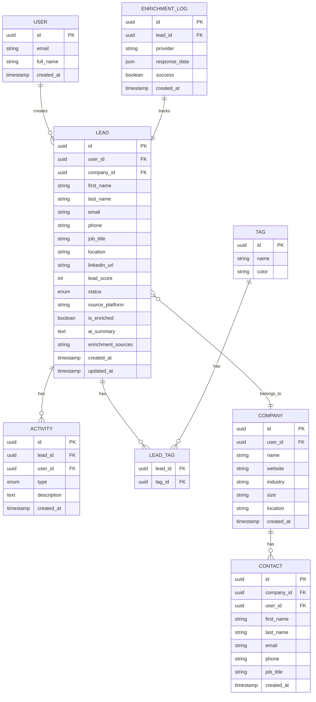
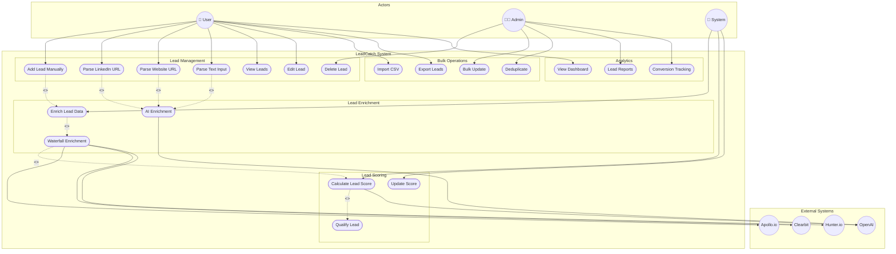
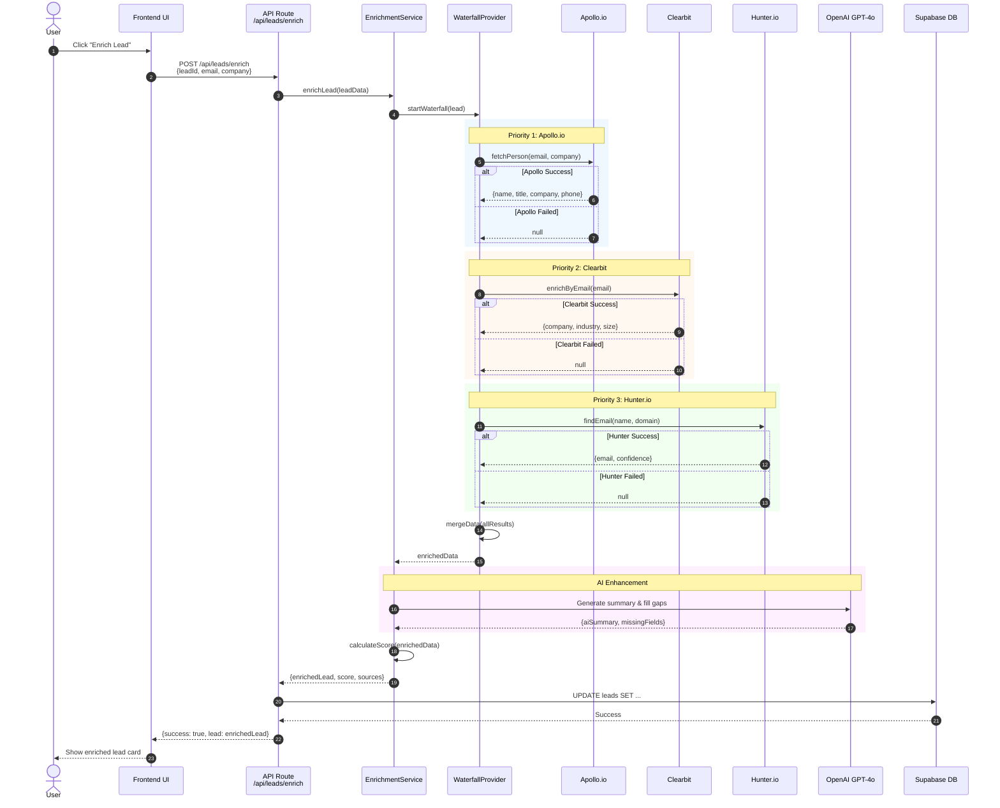
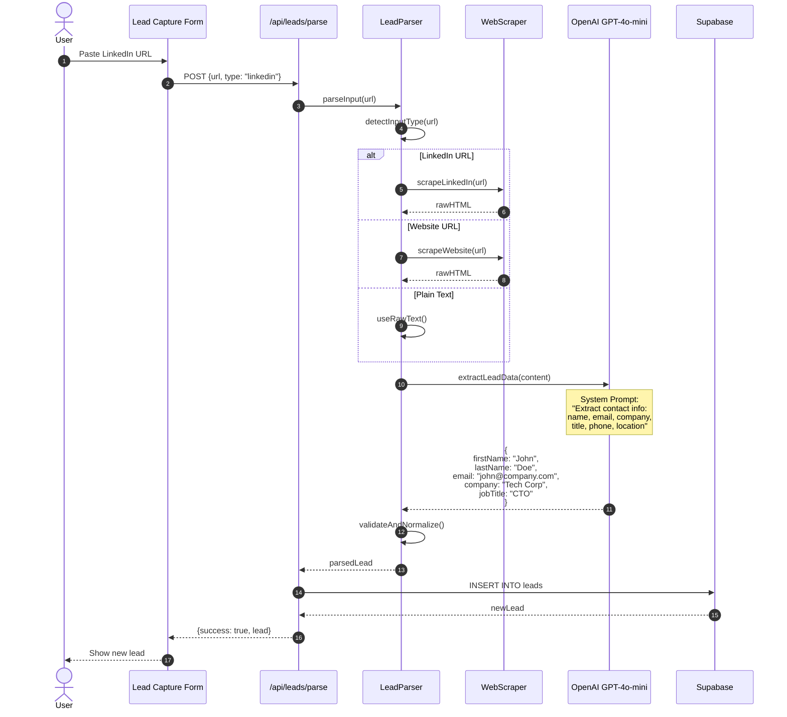
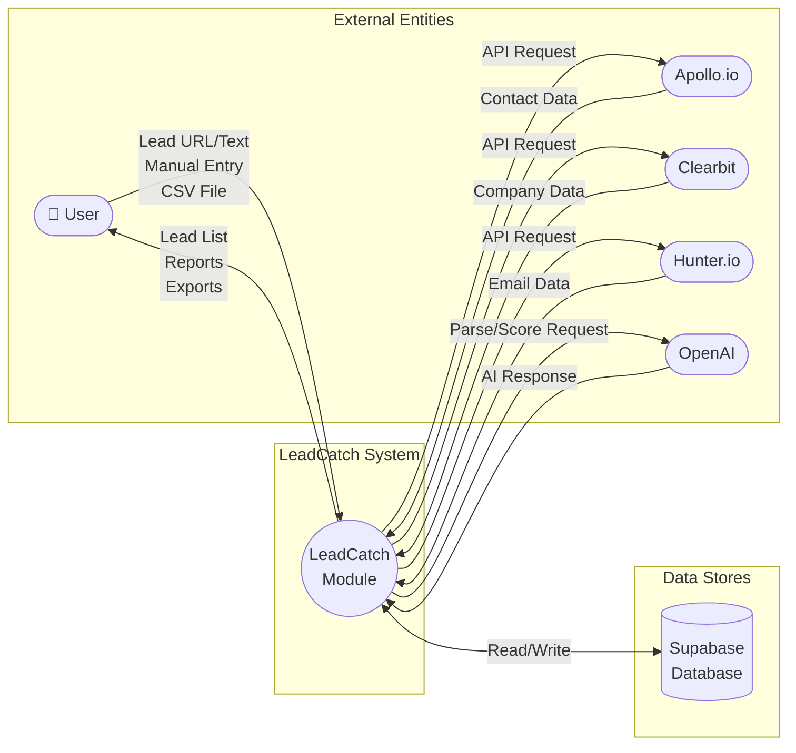
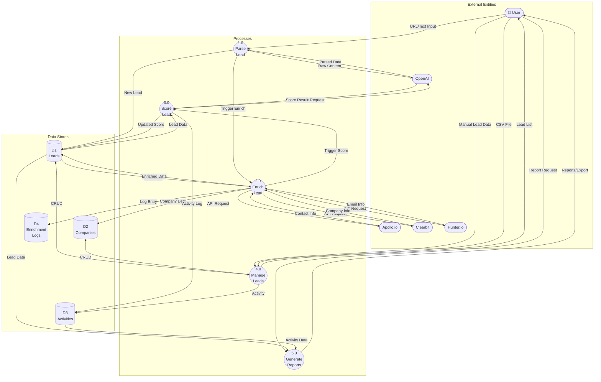
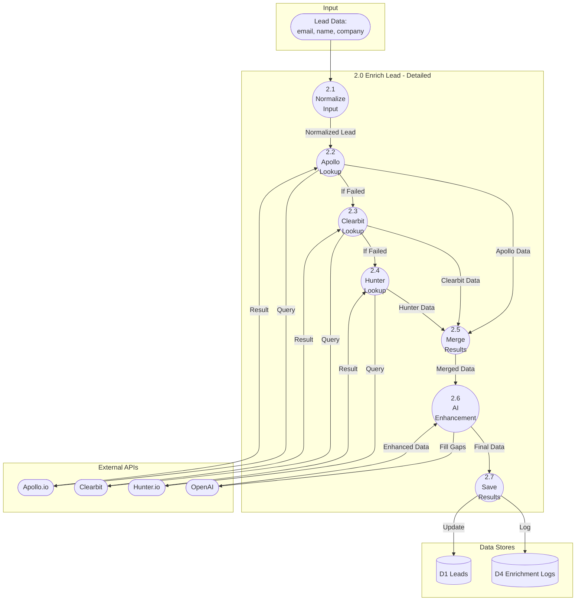
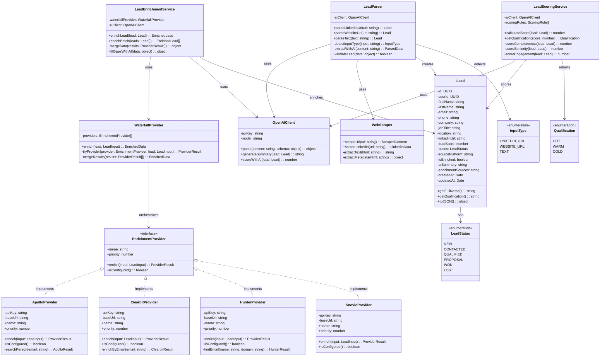

# LeadCatch Module - UML Diagrams

---

## 1. Entity Relationship Diagram (ERD)



### ERD Table Summary

| Entity | Primary Key | Foreign Keys | Description |
|--------|-------------|--------------|-------------|
| **User** | id | - | System users who create leads |
| **Lead** | id | user_id, company_id | Main lead entity with contact info |
| **Company** | id | user_id | Companies associated with leads |
| **Contact** | id | company_id, user_id | Contacts within companies |
| **Tag** | id | - | Tags for categorizing leads |
| **Lead_Tag** | lead_id, tag_id | lead_id, tag_id | Many-to-many relationship |
| **Activity** | id | lead_id, user_id | Lead activity history |
| **Enrichment_Log** | id | lead_id | Tracks enrichment attempts |

---

## 2. Use Case Diagram



### Use Case Descriptions

| Use Case | Actor | Description |
|----------|-------|-------------|
| **Add Lead Manually** | User | Enter lead details via form |
| **Parse LinkedIn URL** | User | Extract lead data from LinkedIn profile |
| **Parse Website URL** | User | Scrape contact info from website |
| **Enrich Lead Data** | System | Automatically enrich with external data |
| **Waterfall Enrichment** | System | Try multiple providers in sequence |
| **Calculate Lead Score** | System | AI-powered scoring (0-100) |
| **Import CSV** | User | Bulk import leads from file |
| **Export Leads** | User | Download leads as CSV |
| **Deduplicate** | Admin | Find and merge duplicate leads |

---

## 3. Sequence Diagram - Lead Enrichment Flow



### Sequence Diagram - Lead Parsing Flow



---

## 4. Data Flow Diagram (DFD)

### Level 0 - Context Diagram



### Level 1 - Main Processes



### Level 2 - Enrichment Process Detail



---

## 5. Class Diagram



### Class Relationships Summary

| Class | Responsibility | Dependencies |
|-------|----------------|--------------|
| **Lead** | Data model for lead entity | - |
| **LeadParser** | Parse URLs and text into leads | OpenAIClient, WebScraper |
| **LeadEnrichmentService** | Orchestrate lead enrichment | WaterfallProvider, OpenAIClient |
| **LeadScoringService** | Calculate lead scores | OpenAIClient |
| **WaterfallProvider** | Try multiple providers in order | EnrichmentProvider implementations |
| **EnrichmentProvider** | Interface for data providers | - |
| **ApolloProvider** | Apollo.io API integration | - |
| **ClearbitProvider** | Clearbit API integration | - |
| **HunterProvider** | Hunter.io API integration | - |
| **WebScraper** | Scrape web pages | - |
| **OpenAIClient** | AI operations | - |

---

## 6. File Structure

```
modules/leadcatch/
├── README.md                    # Module documentation
├── services/
│   ├── index.ts                 # Service exports
│   ├── lead-parser.ts           # Parse LinkedIn/Website/Text
│   ├── lead-enrichment.ts       # Waterfall enrichment orchestrator
│   ├── lead-scoring.ts          # AI-powered scoring algorithm
│   ├── scraper.ts               # Web scraping utilities
│   └── webhooks.ts              # Webhook handlers
├── providers/
│   ├── index.ts                 # Provider exports
│   ├── apollo.ts                # Apollo.io API integration
│   ├── clearbit.ts              # Clearbit API integration
│   ├── hunter.ts                # Hunter.io API integration
│   ├── snovio.ts                # Snov.io API integration
│   ├── emailFinder.ts           # Pattern-based email finder
│   └── waterfall.ts             # Waterfall orchestrator
├── validators/
│   └── (validation schemas)
└── utils/
    └── (helper functions)
```

---

## 7. API Endpoints Summary

| Endpoint | Method | Description | AI Model Used |
|----------|--------|-------------|---------------|
| `/api/leads` | GET | List all leads | - |
| `/api/leads` | POST | Create new lead | - |
| `/api/leads/parse` | POST | Parse URL/Text | GPT-4o-mini |
| `/api/leads/enrich` | POST | Waterfall enrichment | GPT-4o-mini |
| `/api/leads/score` | POST | Calculate lead score | GPT-4o-mini |
| `/api/leads/import` | POST | Bulk import CSV | - |
| `/api/leads/export` | GET | Export to CSV | - |
| `/api/leads/dedupe` | GET/POST | Find/Merge duplicates | - |
| `/api/leads/bulk` | POST | Bulk operations | - |

---

## 8. Technology Stack

```
┌────────────────────────────────────────────────────────────────────────────┐
│                          TECHNOLOGY STACK                                   │
├────────────────────────────────────────────────────────────────────────────┤
│                                                                             │
│   FRONTEND                         BACKEND                                  │
│   ────────                         ───────                                  │
│   • Next.js 15 (App Router)        • Next.js API Routes                    │
│   • React 19                       • TypeScript                            │
│   • Tailwind CSS                   • Zod (Validation)                      │
│   • Framer Motion                                                          │
│                                                                             │
│   AI & ML                          DATA PROVIDERS                           │
│   ──────                           ──────────────                           │
│   • OpenAI GPT-4o-mini             • Apollo.io API                         │
│     - Lead parsing                 • Clearbit API                          │
│     - Scoring                      • Hunter.io API                         │
│     - Summaries                    • Snov.io API                           │
│                                                                             │
│   DATABASE                         AUTHENTICATION                           │
│   ────────                         ──────────────                           │
│   • Supabase (PostgreSQL)          • Supabase Auth                         │
│   • Row Level Security             • JWT Tokens                            │
│                                                                             │
└────────────────────────────────────────────────────────────────────────────┘
```

---

## Summary

The LeadCatch module is a comprehensive lead capture and enrichment system that:

1. **Captures leads** from multiple sources (LinkedIn, websites, text, CSV)
2. **Enriches data** using a waterfall approach (Apollo → Clearbit → Hunter → Snov.io → AI)
3. **Scores leads** using AI and predefined rules
4. **Stores everything** in Supabase with proper user isolation

The AI (GPT-4o-mini) is used for:
- Parsing unstructured text/URLs
- Generating professional summaries
- Filling in missing data gaps
- Contributing to lead scoring
